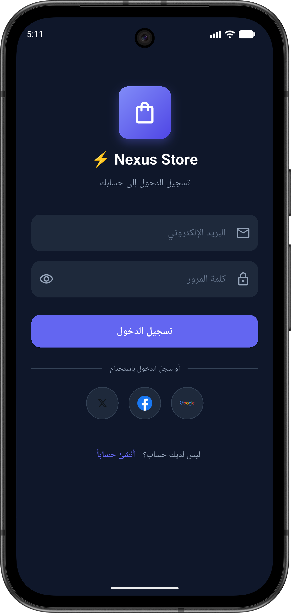
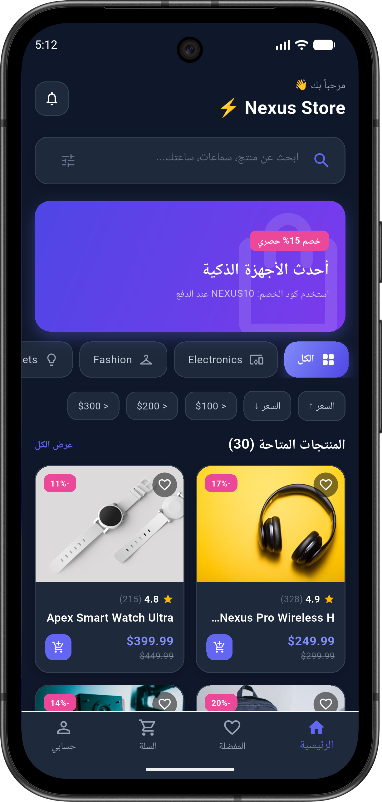
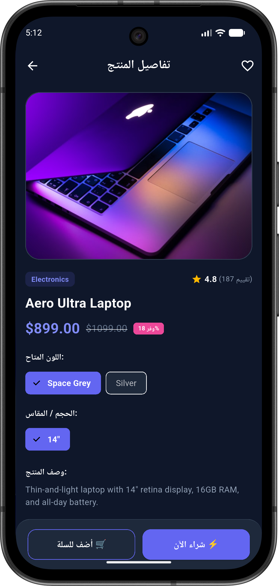
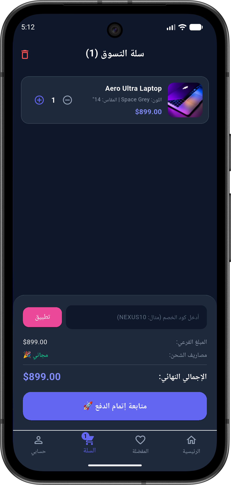
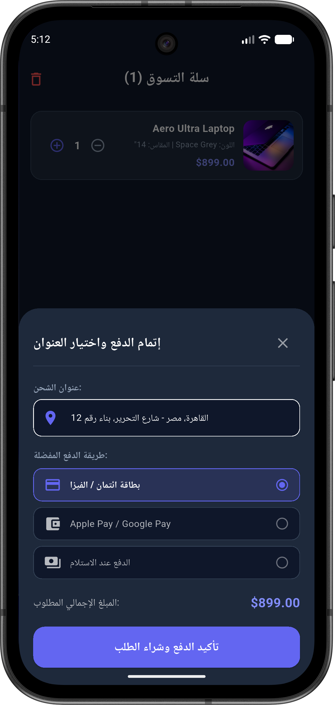
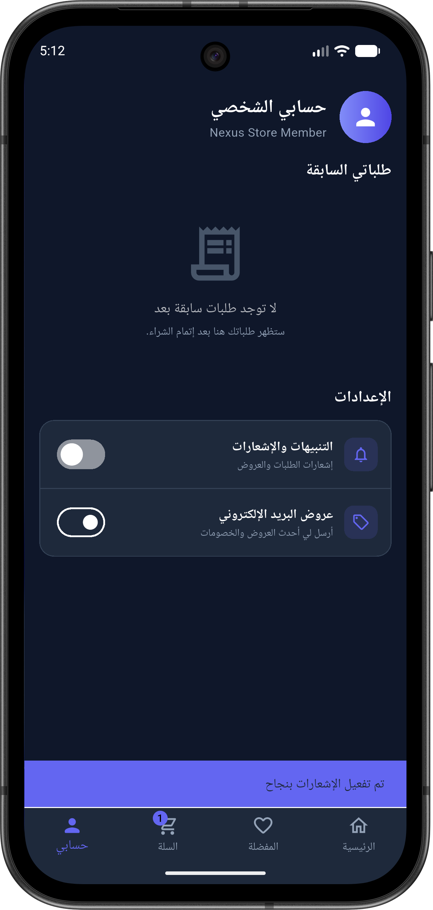

<div align="center">

# 🛍️ NexusStore

**A modern Flutter e-commerce application** for browsing products, managing a wishlist and cart, and completing checkout.

[](https://flutter.dev)
[](https://dart.dev)
[](LICENSE)
[](#)
[](https://github.com/3bdulrah7mann/NexusStore/actions/workflows/flutter.yml)

</div>

---

## 📖 Overview

NexusStore is a full-featured e-commerce mobile app built with Flutter, showcasing a clean architecture with **Provider** state management, a polished **dark-only UI**, onboarding flow, and a complete shopping experience from product discovery to checkout.

## ✨ Features

| Feature | Description |
|---|---|
| 🛒 **Product Catalog** | Browse 30+ products with detailed product pages and Fade/Slide entrance animations |
| 🧺 **Cart & Checkout** | Full cart management and checkout flow |
| ❤️ **Wishlist** | Save favorite products for later |
| 🌑 **Dark Theme (Fixed)** | A polished, fixed dark theme — no light mode |
| 🚪 **Onboarding** | Splash → Login/SignUp flow with real Google / Facebook / X social icons |
| 🔔 **Notifications** | Toggleable in-app notifications with feedback |
| ⚙️ **State Management** | Powered by Provider |

## 📱 Screenshots

<div align="center">








</div>

## 🚀 Getting Started

### Requirements

- Flutter SDK (Dart SDK `^3.12.2`)
- Android Studio / Xcode (for emulator or device deployment)

### Installation

```bash
git clone https://github.com/3bdulrah7mann/NexusStore.git
cd NexusStore
flutter pub get
flutter run
```

### Build an Android APK

```bash
flutter build apk --release
```

The generated APK is copied to `build/apk/` as `NexusStore-release.apk`.

## 🏗️ Project Structure

```
NexusStore/
├── lib/
│   ├── models/       # App data models
│   ├── providers/    # Application state
│   ├── views/        # Screens and tabs (incl. onboarding)
│   └── widgets/       # Reusable UI components
├── assets/           # Product images and app assets
├── android/          # Android platform code
└── ios/              # iOS platform code
```

## 🧰 Tech Stack

- **Framework:** Flutter
- **Language:** Dart
- **State Management:** Provider
- **CI/CD:** GitHub Actions (Flutter CI)

## 🤝 Contributing

Contributions are welcome! Please open an issue or submit a pull request.

1. Fork the repository
2. Create your feature branch (`git checkout -b feat/amazing-feature`)
3. Commit your changes (`git commit -m 'feat: add amazing feature'`)
4. Push to the branch (`git push origin feat/amazing-feature`)
5. Open a Pull Request

## 📄 License

This project is licensed under the MIT License — see the [LICENSE](LICENSE) file for details.

---

<div align="center">

Made with ❤️ using Flutter

</div>
